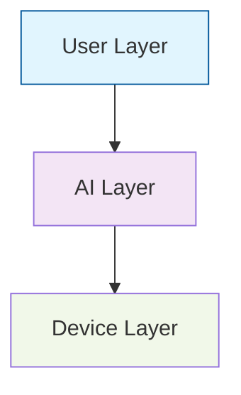

# 🎨 Mermaid Chart MCP

[](https://badge.fury.io/js/@pickstar-2002%2Fmermaid-chart-mcp)
[](https://opensource.org/licenses/MIT)
[](https://nodejs.org/)
[](https://modelcontextprotocol.io/)

> 🚀 A powerful Model Context Protocol (MCP) server for rendering beautiful Mermaid charts with online hosting support

## ✨ Features

- 🎯 **Single & Batch Rendering** - Render individual charts or process multiple diagrams at once
- 🖼️ **Multiple Formats** - Support for PNG and SVG output formats
- 🌐 **Online Hosting** - Automatic static server with shareable links
- 🎨 **Rich Styling** - Full support for Mermaid themes, colors, and custom styles
- 🌍 **Internationalization** - Perfect support for Chinese and other languages
- ⚡ **High Performance** - Optimized rendering with configurable quality settings
- 🔧 **Easy Integration** - Seamless integration with AI IDEs and MCP clients

## 📦 Installation

### Quick Start (Recommended)

```bash
npx @pickstar-2002/mermaid-chart-mcp@latest
```

### Global Installation

```bash
npm install -g @pickstar-2002/mermaid-chart-mcp@latest
```

### Local Installation

```bash
npm install @pickstar-2002/mermaid-chart-mcp@latest
```

## 🚀 Usage

### IDE Configuration

Add the following configuration to your MCP-compatible IDE:

#### For Cursor, WindSurf, CodeBuddy, etc.

```json
{
  "mcpServers": {
    "mermaid-chart-mcp": {
      "command": "npx",
      "args": ["@pickstar-2002/mermaid-chart-mcp@latest"]
    }
  }
}
```

#### Alternative Configuration

```json
{
  "mcpServers": {
    "mermaid-chart-mcp": {
      "command": "node",
      "args": ["path/to/node_modules/@pickstar-2002/mermaid-chart-mcp/dist/index.js"]
    }
  }
}
```

### Basic Usage Examples

#### Single Chart Rendering

```javascript
// Render a flowchart to PNG
{
  "code": "graph TD\n    A[Start] --> B[Process]\n    B --> C[End]",
  "options": {
    "format": "png",
    "generateOnlineLink": true,
    "theme": "default"
  }
}
```

#### Batch Rendering

```javascript
// Render multiple charts at once
{
  "requests": [
    {
      "code": "graph LR\n    A --> B --> C",
      "options": { "format": "png" }
    },
    {
      "code": "sequenceDiagram\n    Alice->>Bob: Hello",
      "options": { "format": "svg" }
    }
  ],
  "globalOptions": {
    "theme": "dark",
    "backgroundColor": "transparent"
  }
}
```

## 🛠️ API Reference

### Tools Available

#### `render_mermaid`
Render a single Mermaid diagram to image.

**Parameters:**
- `code` (string): Mermaid diagram code
- `options` (object, optional): Rendering options
  - `format` (string): Output format (`png` | `svg`)
  - `outputPath` (string): Custom output file path
  - `generateOnlineLink` (boolean): Generate shareable online link
  - `theme` (string): Mermaid theme (`default` | `dark` | `forest` | `neutral`)
  - `backgroundColor` (string): Background color
  - `width` (number): Image width in pixels
  - `height` (number): Image height in pixels
  - `dpi` (number): DPI for PNG output

#### `batch_render_mermaid`
Render multiple Mermaid diagrams in batch.

**Parameters:**
- `requests` (array): Array of render requests
- `globalOptions` (object, optional): Global options applied to all requests

#### `start_static_server`
Start the built-in static file server for online hosting.

#### `stop_static_server`
Stop the static file server.

#### `update_config`
Update server configuration.

#### `get_config`
Get current server configuration.

## 🎨 Supported Diagram Types

- 📊 **Flowcharts** - Process flows and decision trees
- 🔄 **Sequence Diagrams** - Interaction flows between entities
- 📈 **Gantt Charts** - Project timelines and schedules
- 🥧 **Pie Charts** - Data distribution visualization
- 🌳 **Git Graphs** - Version control workflows
- 📋 **Class Diagrams** - Object-oriented design
- 🗺️ **User Journey** - User experience mapping
- ⏰ **Timeline** - Chronological events
- 📊 **Quadrant Chart** - Priority matrices
- 🏛️ **C4 Diagrams** - Software architecture

## 🎯 Advanced Features

### Custom Styling



### Online Link Generation

Enable `generateOnlineLink: true` to automatically:
- 🌐 Start a local static server
- 📎 Generate shareable URLs
- 🔗 Access charts from anywhere

### Batch Processing

Process multiple diagrams efficiently:
- ⚡ Concurrent rendering
- 🎛️ Global configuration options
- 📊 Detailed success/failure reporting

## 🔧 Configuration

### Default Settings

```json
{
  "tempDir": "./temp",
  "defaultOutputDir": "./output",
  "serverPort": 3000,
  "serverHost": "localhost",
  "enableStaticServer": true,
  "maxConcurrentRenders": 5
}
```

### Environment Variables

- `MERMAID_TEMP_DIR` - Temporary files directory
- `MERMAID_OUTPUT_DIR` - Default output directory
- `MERMAID_SERVER_PORT` - Static server port
- `MERMAID_MAX_CONCURRENT` - Maximum concurrent renders

## 🤝 Contributing

Contributions are welcome! Please feel free to submit a Pull Request.

1. Fork the repository
2. Create your feature branch (`git checkout -b feature/AmazingFeature`)
3. Commit your changes (`git commit -m 'Add some AmazingFeature'`)
4. Push to the branch (`git push origin feature/AmazingFeature`)
5. Open a Pull Request

## 📄 License

This project is licensed under the MIT License - see the [LICENSE](LICENSE) file for details.

## 👨‍💻 Author

**pickstar-2002**

- 📧 Email: [Contact via GitHub](https://github.com/pickstar-2002)
- 🐙 GitHub: [@pickstar-2002](https://github.com/pickstar-2002)
- 💬 微信: pickstar_loveXX

## 🙏 Acknowledgments

- [Mermaid.js](https://mermaid.js.org/) - For the amazing diagramming syntax
- [Model Context Protocol](https://modelcontextprotocol.io/) - For the MCP specification
- All contributors who help improve this project

---

<div align="center">
  <p>Made with ❤️ by pickstar-2002</p>
  <p>⭐ Star this repo if you find it helpful!</p>
</div>