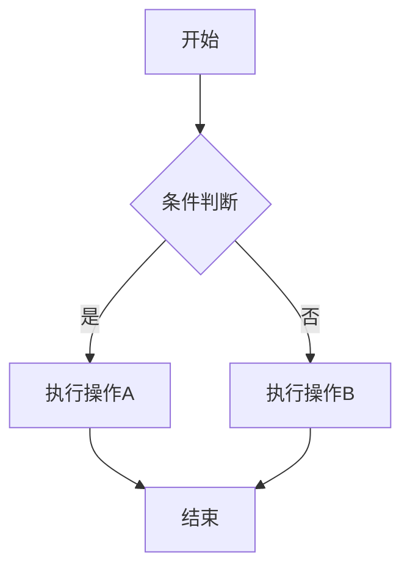
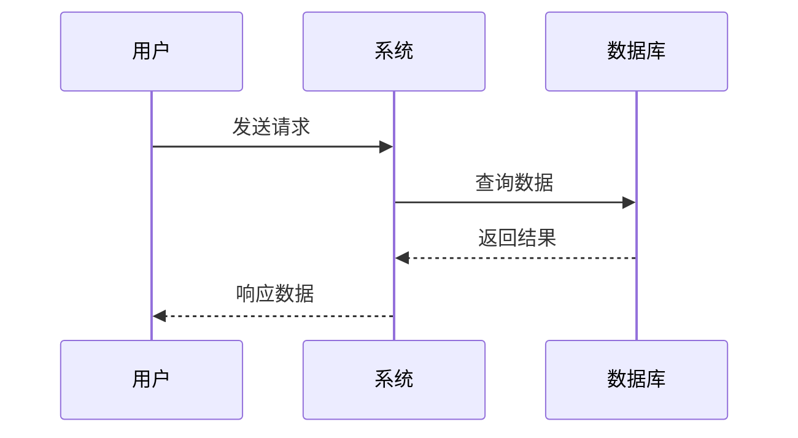
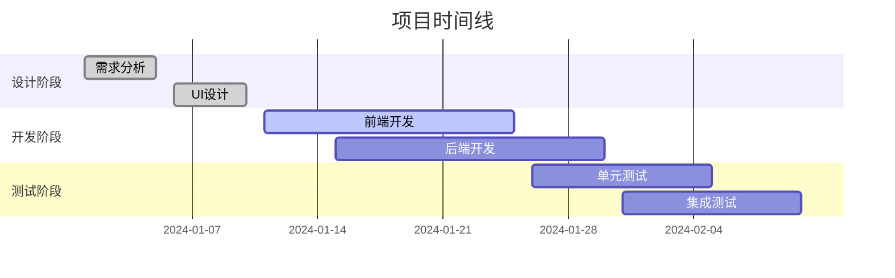
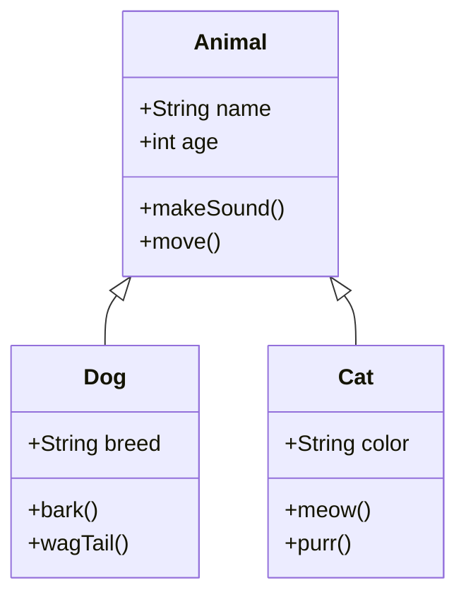
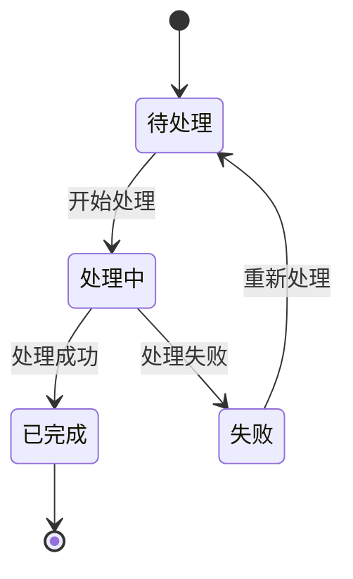
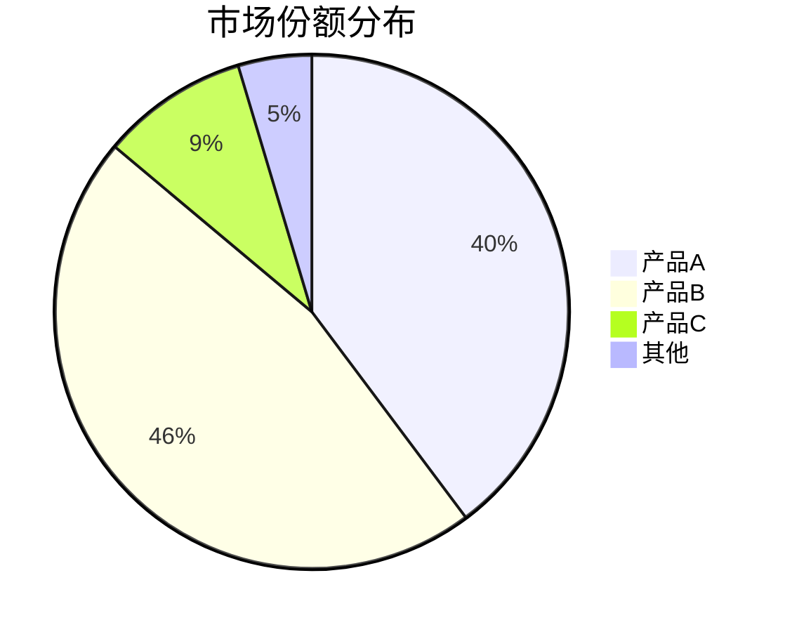
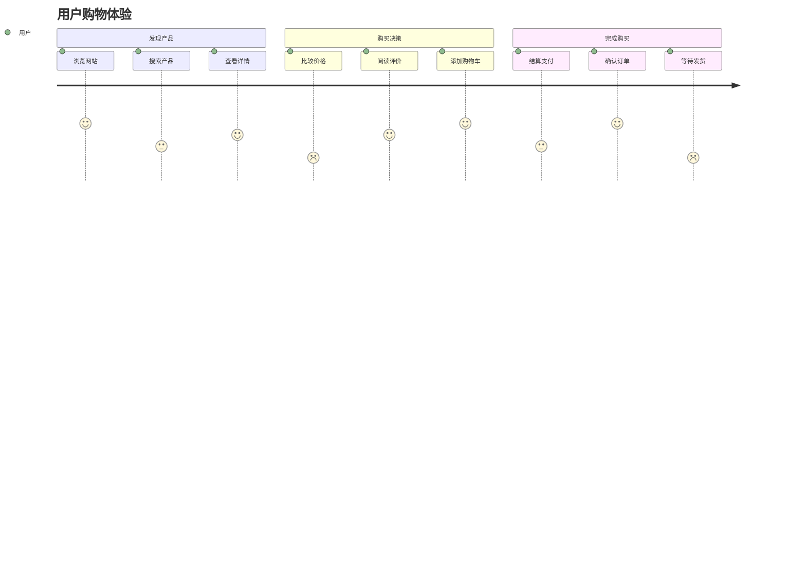
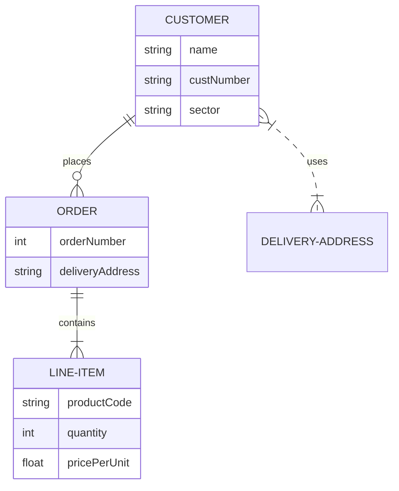

# Mermaid Chart MCP 使用示例

## 基础流程图



## 序列图



## 甘特图



## 类图



## 状态图



## 饼图



## 用户旅程图



## Git 流程图

```mermaid
gitgraph
    commit id: "初始提交"
    branch develop
    checkout develop
    commit id: "添加功能A"
    commit id: "修复bug"
    checkout main
    merge develop
    commit id: "发布v1.0"
    branch feature
    checkout feature
    commit id: "开发新功能"
    checkout develop
    merge feature
    checkout main
    merge develop
    commit id: "发布v1.1"
```

## 实体关系图



## 使用这些示例

你可以将上述任何一个 Mermaid 代码复制并使用 MCP 工具进行渲染：

### 渲染为在线图片
```javascript
{
  "mermaidCode": "graph TD\n    A[开始] --> B[结束]",
  "format": "png",
  "theme": "default"
}
```

### 保存到本地
```javascript
{
  "mermaidCode": "sequenceDiagram\n    A->>B: Hello",
  "localPath": "./diagrams",
  "filename": "sequence.png",
  "format": "png",
  "theme": "dark"
}