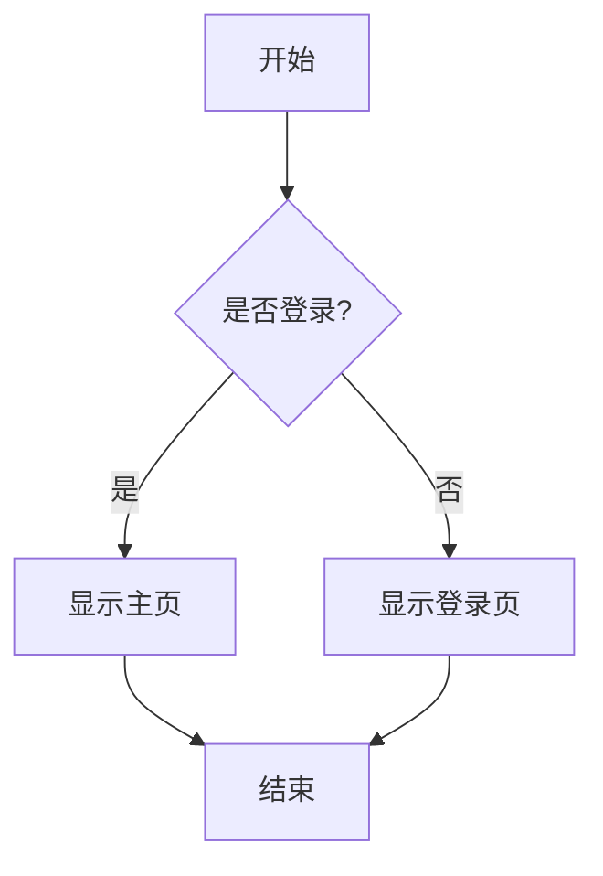
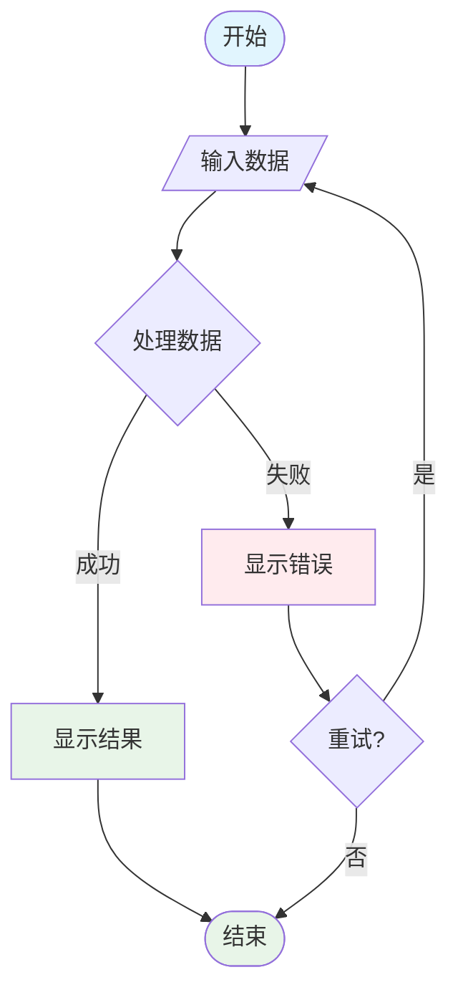

# 流程图示例

## 基本流程图


```mermaid
graph TD
    A[开始] --> B{是否登录?}
    B -->|是| C[显示主页]
    B -->|否| D[显示登录页]
    C --> E[结束]
    D --> E
```

## 复杂流程图


```mermaid
graph TB
    Start([开始]) --> Input[/输入数据/]
    Input --> Process{处理数据}
    Process -->|成功| Success[显示结果]
    Process -->|失败| Error[显示错误]
    Success --> End([结束])
    Error --> Retry{重试?}
    Retry -->|是| Input
    Retry -->|否| End
    
    style Start fill:#e1f5fe
    style End fill:#e8f5e8
    style Error fill:#ffebee
    style Success fill:#e8f5e8
```

## 左右布局流程图

```mermaid
graph LR
    A[用户请求] --> B[身份验证]
    B --> C{验证结果}
    C -->|通过| D[访问资源]
    C -->|失败| E[拒绝访问]
    D --> F[返回数据]
    E --> G[返回错误]