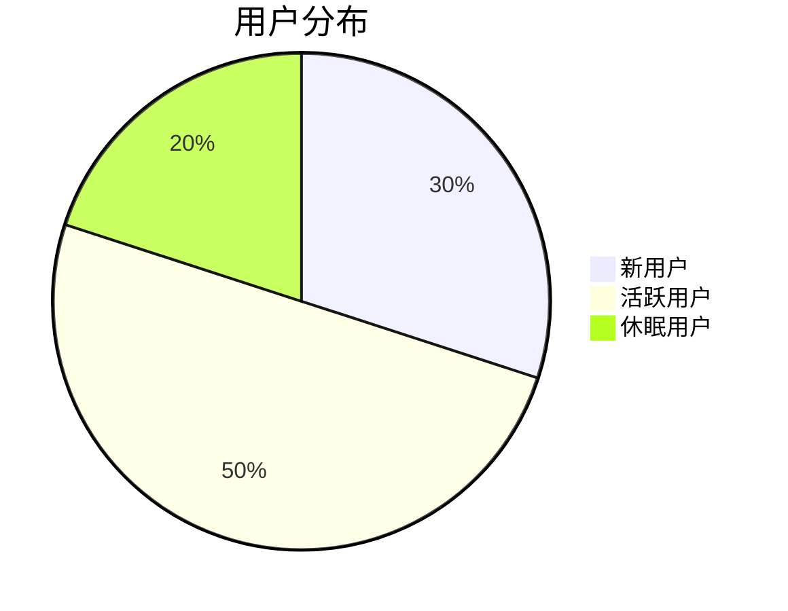
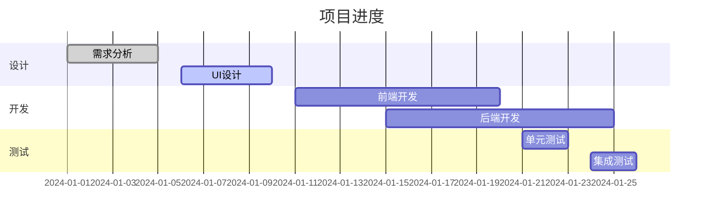
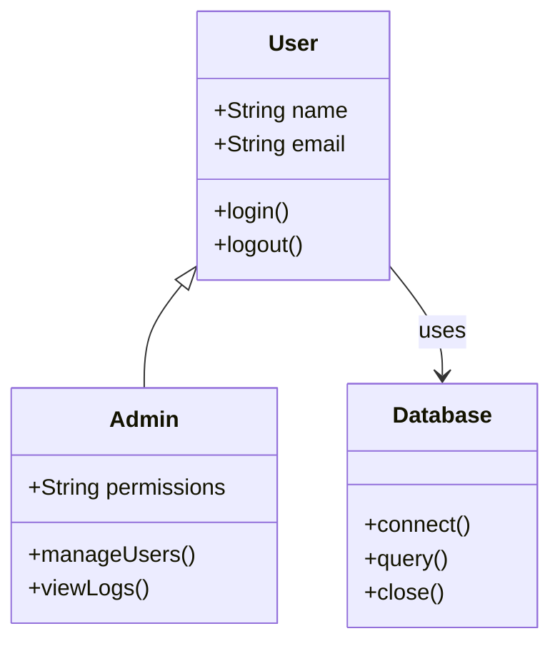
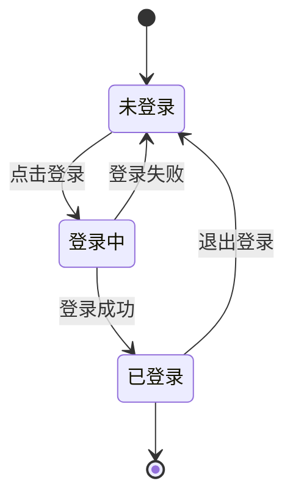
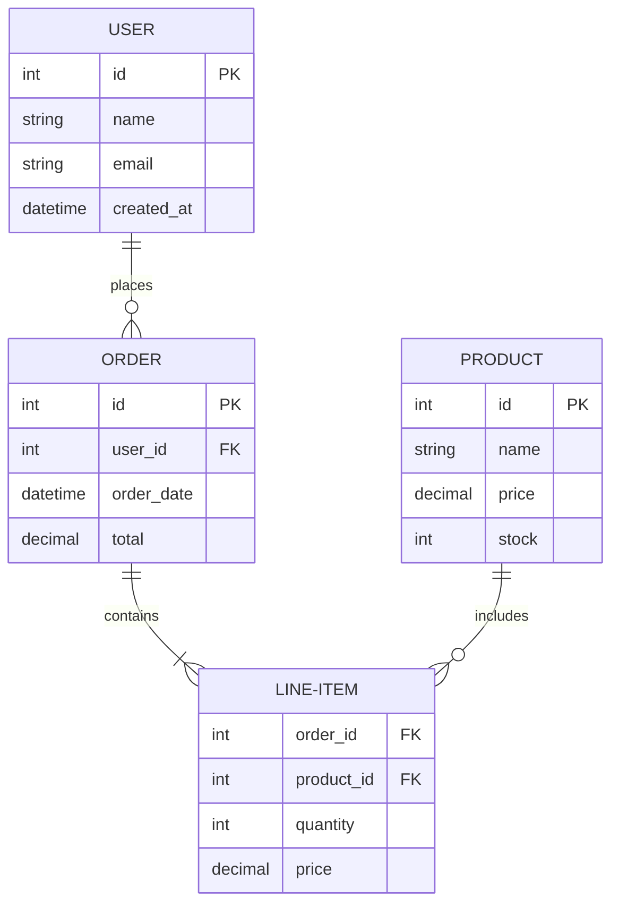

# 其他类型图表示例

## 饼图



## 甘特图



## 类图



## 状态图



## ER图



## 思维导图

```mermaid
mindmap
  root((项目管理))
    规划
      需求分析
      时间安排
      资源分配
    执行
      任务分配
      进度跟踪
      质量控制
    监控
      风险管理
      成本控制
      沟通协调
    收尾
      项目验收
      经验总结
      文档归档