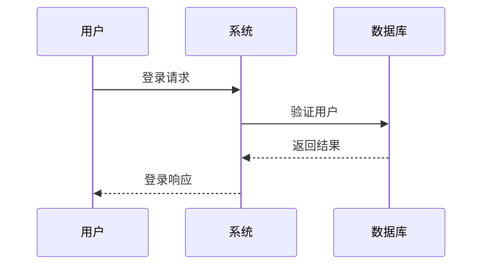
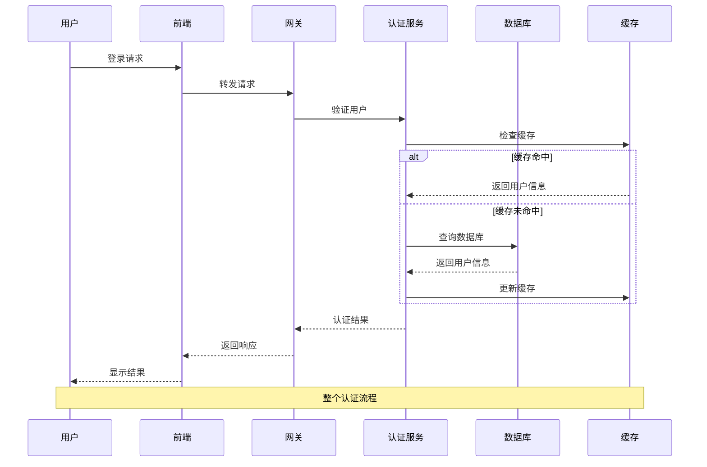

# 序列图示例

## 基本序列图



## 复杂序列图



## 带循环的序列图

```mermaid
sequenceDiagram
    participant C as 客户端
    participant S as 服务器
    
    C->>S: 连接请求
    S-->>C: 连接确认
    
    loop 心跳检测
        C->>S: 心跳包
        S-->>C: 心跳响应
    end
    
    C->>S: 断开连接
    S-->>C: 断开确认